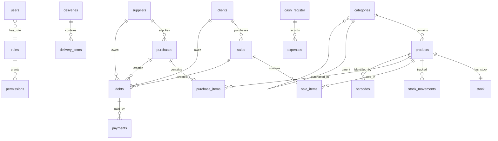

# ParaFarm ERP — Database Design (SQLite)

> **Engine**: SQLite 3 with WAL mode  
> **ORM**: SQLAlchemy 2.0 + Alembic migrations  
> **Pattern**: Repository — all access via repository classes

## Global Conventions

| Convention | Rule |
|---|---|
| Primary Keys | `id` INTEGER PRIMARY KEY AUTOINCREMENT |
| Timestamps | `created_at` TEXT DEFAULT (datetime('now','localtime')), `updated_at` TEXT |
| Soft Delete | `is_deleted` INTEGER DEFAULT 0, `deleted_at` TEXT NULL |
| Money | REAL with 2-decimal formatting in application layer (SQLite has no DECIMAL) |
| Enums | TEXT with Python Enum validation in model layer |
| Booleans | INTEGER (0/1) — SQLite convention |
| Indexes | All FKs, search columns (name, barcode, code), date columns |

## SQLite Initialization

```python
# database.py
engine = create_engine(
    f"sqlite:///{db_path}",
    connect_args={"check_same_thread": False},
    echo=False
)

@event.listens_for(engine, "connect")
def set_sqlite_pragma(dbapi_conn, connection_record):
    cursor = dbapi_conn.cursor()
    cursor.execute("PRAGMA journal_mode=WAL")
    cursor.execute("PRAGMA synchronous=NORMAL")
    cursor.execute("PRAGMA foreign_keys=ON")
    cursor.execute("PRAGMA cache_size=-8000")  # 8MB cache
    cursor.execute("PRAGMA busy_timeout=5000")
    cursor.close()
```

---

## TABLE: `users`

| Column | Type | Constraints |
|---|---|---|
| id | INTEGER | PK AUTO |
| username | TEXT | UNIQUE NOT NULL |
| password_hash | TEXT | NOT NULL |
| full_name | TEXT | NOT NULL |
| role_id | INTEGER | FK roles.id NOT NULL |
| pin_code | TEXT | NULL (hashed numeric PIN) |
| is_active | INTEGER | DEFAULT 1 |
| last_login | TEXT | NULL |
| failed_attempts | INTEGER | DEFAULT 0 |
| last_failed_at | TEXT | NULL |
| is_deleted | INTEGER | DEFAULT 0 |
| created_at | TEXT | DEFAULT datetime('now','localtime') |
| updated_at | TEXT | NULL |

---

## TABLE: `roles`

| Column | Type | Constraints |
|---|---|---|
| id | INTEGER | PK AUTO |
| name | TEXT | UNIQUE NOT NULL |
| description | TEXT | NULL |
| is_system | INTEGER | DEFAULT 0 |

Default rows: ADMIN, CAISSIER, GESTIONNAIRE_STOCK, COMPTABLE, LIVREUR, SUPERVISEUR

---

## TABLE: `permissions`

| Column | Type | Constraints |
|---|---|---|
| id | INTEGER | PK AUTO |
| role_id | INTEGER | FK roles.id NOT NULL |
| module | TEXT | NOT NULL |
| action | TEXT | NOT NULL (CREATE/READ/UPDATE/DELETE/PRINT/VOID/EXPORT) |
| is_allowed | INTEGER | DEFAULT 1 |

UNIQUE(role_id, module, action)

---

## TABLE: `categories`

| Column | Type | Constraints |
|---|---|---|
| id | INTEGER | PK AUTO |
| name | TEXT | NOT NULL |
| parent_id | INTEGER | FK categories.id NULL (hierarchy) |
| sort_order | INTEGER | DEFAULT 0 |
| is_active | INTEGER | DEFAULT 1 |
| is_deleted | INTEGER | DEFAULT 0 |
| created_at | TEXT | DEFAULT now |

---

## TABLE: `products`

| Column | Type | Constraints |
|---|---|---|
| id | INTEGER | PK AUTO |
| code | TEXT | UNIQUE NOT NULL (PRD-XXXXX) |
| barcode | TEXT | UNIQUE NULL |
| name | TEXT | NOT NULL |
| description | TEXT | NULL |
| category_id | INTEGER | FK categories.id NULL |
| cost_price | REAL | NOT NULL DEFAULT 0 |
| selling_price | REAL | NOT NULL |
| wholesale_price | REAL | NULL |
| tax_rate | REAL | NOT NULL DEFAULT 0 (0, 9, or 19) |
| min_stock_level | INTEGER | DEFAULT 10 |
| unit | TEXT | DEFAULT 'Unité' |
| image_path | TEXT | NULL |
| is_active | INTEGER | DEFAULT 1 |
| is_deleted | INTEGER | DEFAULT 0 |
| created_by | INTEGER | FK users.id |
| created_at | TEXT | DEFAULT now |
| updated_at | TEXT | NULL |

Indexes: `idx_products_barcode`, `idx_products_name`, `idx_products_code`, `idx_products_category`

---

## TABLE: `stock`

| Column | Type | Constraints |
|---|---|---|
| id | INTEGER | PK AUTO |
| product_id | INTEGER | FK products.id UNIQUE NOT NULL |
| quantity | REAL | NOT NULL DEFAULT 0 |
| reserved_quantity | REAL | DEFAULT 0 |
| last_counted_at | TEXT | NULL |
| updated_at | TEXT | NULL |

---

## TABLE: `stock_movements`

| Column | Type | Constraints |
|---|---|---|
| id | INTEGER | PK AUTO |
| product_id | INTEGER | FK products.id NOT NULL |
| movement_type | TEXT | NOT NULL (PURCHASE_IN/SALE_OUT/RETURN_IN/RETURN_OUT/ADJUSTMENT/DAMAGE/EXPIRED) |
| quantity | REAL | NOT NULL (positive=in, negative=out) |
| unit_cost | REAL | NULL |
| reference_type | TEXT | NULL (SALE/PURCHASE/ADJUSTMENT) |
| reference_id | INTEGER | NULL |
| batch_number | TEXT | NULL |
| expiry_date | TEXT | NULL (YYYY-MM-DD) |
| notes | TEXT | NULL |
| user_id | INTEGER | FK users.id NOT NULL |
| created_at | TEXT | DEFAULT now |

Indexes: `idx_sm_product`, `idx_sm_type`, `idx_sm_reference`, `idx_sm_expiry`, `idx_sm_created`

---

## TABLE: `clients`

| Column | Type | Constraints |
|---|---|---|
| id | INTEGER | PK AUTO |
| code | TEXT | UNIQUE NOT NULL (CLT-XXXXX) |
| name | TEXT | NOT NULL |
| client_type | TEXT | DEFAULT 'PARTICULIER' (PARTICULIER/ENTREPRISE) |
| phone | TEXT | NULL |
| email | TEXT | NULL |
| address | TEXT | NULL |
| tax_id | TEXT | NULL |
| credit_limit | REAL | DEFAULT 0 |
| notes | TEXT | NULL |
| is_active | INTEGER | DEFAULT 1 |
| is_deleted | INTEGER | DEFAULT 0 |
| created_at | TEXT | DEFAULT now |
| updated_at | TEXT | NULL |

---

## TABLE: `suppliers`

| Column | Type | Constraints |
|---|---|---|
| id | INTEGER | PK AUTO |
| code | TEXT | UNIQUE NOT NULL (FRS-XXXXX) |
| name | TEXT | NOT NULL |
| category | TEXT | NULL (PHARMACEUTIQUE/PARAPHARMACIE/COSMETIQUE/GENERAL) |
| phone | TEXT | NULL |
| email | TEXT | NULL |
| address | TEXT | NULL |
| tax_id | TEXT | NULL |
| credit_period_days | INTEGER | DEFAULT 30 |
| credit_limit | REAL | DEFAULT 0 |
| notes | TEXT | NULL |
| is_active | INTEGER | DEFAULT 1 |
| is_deleted | INTEGER | DEFAULT 0 |
| created_at | TEXT | DEFAULT now |
| updated_at | TEXT | NULL |

---

## TABLE: `sales`

| Column | Type | Constraints |
|---|---|---|
| id | INTEGER | PK AUTO |
| sale_number | TEXT | UNIQUE NOT NULL (VNT-YYYYMMDD-XXXX) |
| client_id | INTEGER | FK clients.id NULL (NULL=walk-in) |
| cashier_id | INTEGER | FK users.id NOT NULL |
| sale_date | TEXT | NOT NULL DEFAULT now |
| subtotal | REAL | NOT NULL |
| discount_amount | REAL | DEFAULT 0 |
| discount_type | TEXT | NULL (PERCENTAGE/FIXED) |
| discount_value | REAL | DEFAULT 0 |
| tax_total | REAL | DEFAULT 0 |
| total_amount | REAL | NOT NULL |
| paid_amount | REAL | DEFAULT 0 |
| change_amount | REAL | DEFAULT 0 |
| payment_method | TEXT | NOT NULL (ESPECES/CARTE/MIXTE/CREDIT) |
| status | TEXT | DEFAULT 'COMPLETED' (COMPLETED/VOIDED/RETURNED) |
| void_reason | TEXT | NULL |
| voided_by | INTEGER | FK users.id NULL |
| voided_at | TEXT | NULL |
| notes | TEXT | NULL |
| cash_register_id | INTEGER | FK cash_register.id NULL |
| is_deleted | INTEGER | DEFAULT 0 |
| created_at | TEXT | DEFAULT now |

Indexes: `idx_sales_number`, `idx_sales_client`, `idx_sales_cashier`, `idx_sales_date`, `idx_sales_status`

---

## TABLE: `sale_items`

| Column | Type | Constraints |
|---|---|---|
| id | INTEGER | PK AUTO |
| sale_id | INTEGER | FK sales.id NOT NULL (CASCADE DELETE) |
| product_id | INTEGER | FK products.id NOT NULL |
| quantity | REAL | NOT NULL |
| unit_price | REAL | NOT NULL (snapshot) |
| cost_price | REAL | NOT NULL (snapshot for profit) |
| discount_amount | REAL | DEFAULT 0 |
| tax_rate | REAL | NOT NULL (snapshot) |
| tax_amount | REAL | DEFAULT 0 |
| line_total | REAL | NOT NULL |

---

## TABLE: `purchases`

| Column | Type | Constraints |
|---|---|---|
| id | INTEGER | PK AUTO |
| purchase_number | TEXT | UNIQUE NOT NULL (ACH-YYYYMMDD-XXXX) |
| supplier_id | INTEGER | FK suppliers.id NOT NULL |
| purchase_date | TEXT | NOT NULL DEFAULT now |
| status | TEXT | DEFAULT 'DRAFT' (DRAFT/CONFIRMED/PARTIAL_RECEIVED/RECEIVED/CLOSED/CANCELLED) |
| subtotal | REAL | NOT NULL |
| discount_amount | REAL | DEFAULT 0 |
| tax_total | REAL | DEFAULT 0 |
| total_amount | REAL | NOT NULL |
| invoice_number | TEXT | NULL (supplier invoice ref) |
| invoice_date | TEXT | NULL |
| notes | TEXT | NULL |
| received_by | INTEGER | FK users.id NULL |
| received_at | TEXT | NULL |
| created_by | INTEGER | FK users.id |
| is_deleted | INTEGER | DEFAULT 0 |
| created_at | TEXT | DEFAULT now |

---

## TABLE: `purchase_items`

| Column | Type | Constraints |
|---|---|---|
| id | INTEGER | PK AUTO |
| purchase_id | INTEGER | FK purchases.id (CASCADE DELETE) |
| product_id | INTEGER | FK products.id NOT NULL |
| ordered_qty | REAL | NOT NULL |
| received_qty | REAL | DEFAULT 0 |
| unit_cost | REAL | NOT NULL |
| line_total | REAL | NOT NULL |
| batch_number | TEXT | NULL |
| expiry_date | TEXT | NULL |

---

## TABLE: `deliveries`

| Column | Type | Constraints |
|---|---|---|
| id | INTEGER | PK AUTO |
| delivery_number | TEXT | UNIQUE NOT NULL (LVR-YYYYMMDD-XXXX) |
| sale_id | INTEGER | FK sales.id NULL |
| client_id | INTEGER | FK clients.id NOT NULL |
| operator_id | INTEGER | FK users.id NULL |
| status | TEXT | DEFAULT 'PENDING' (PENDING/IN_TRANSIT/DELIVERED/FAILED/CANCELLED) |
| scheduled_date | TEXT | NULL |
| delivered_at | TEXT | NULL |
| failure_reason | TEXT | NULL |
| zone | TEXT | NULL |
| address | TEXT | NULL |
| notes | TEXT | NULL |
| created_by | INTEGER | FK users.id |
| is_deleted | INTEGER | DEFAULT 0 |
| created_at | TEXT | DEFAULT now |

---

## TABLE: `delivery_items`

| Column | Type | Constraints |
|---|---|---|
| id | INTEGER | PK AUTO |
| delivery_id | INTEGER | FK deliveries.id (CASCADE DELETE) |
| product_id | INTEGER | FK products.id NOT NULL |
| quantity | REAL | NOT NULL |
| delivered_qty | REAL | DEFAULT 0 |

---

## TABLE: `debts`

| Column | Type | Constraints |
|---|---|---|
| id | INTEGER | PK AUTO |
| entity_type | TEXT | NOT NULL (CLIENT/SUPPLIER) |
| entity_id | INTEGER | NOT NULL |
| reference_type | TEXT | NOT NULL (SALE/PURCHASE) |
| reference_id | INTEGER | NOT NULL |
| total_amount | REAL | NOT NULL |
| paid_amount | REAL | DEFAULT 0 |
| remaining_amount | REAL | NOT NULL |
| status | TEXT | DEFAULT 'PENDING' (PENDING/PARTIAL/PAID/WRITTEN_OFF) |
| due_date | TEXT | NULL |
| notes | TEXT | NULL |
| is_deleted | INTEGER | DEFAULT 0 |
| created_at | TEXT | DEFAULT now |
| updated_at | TEXT | NULL |

Indexes: `idx_debts_entity`, `idx_debts_status`, `idx_debts_due_date`

---

## TABLE: `payments`

| Column | Type | Constraints |
|---|---|---|
| id | INTEGER | PK AUTO |
| debt_id | INTEGER | FK debts.id NOT NULL |
| amount | REAL | NOT NULL |
| payment_method | TEXT | NOT NULL (ESPECES/CARTE/VIREMENT/CHEQUE) |
| payment_date | TEXT | NOT NULL DEFAULT now |
| reference_number | TEXT | NULL |
| received_by | INTEGER | FK users.id NOT NULL |
| notes | TEXT | NULL |
| created_at | TEXT | DEFAULT now |

---

## TABLE: `cash_register`

| Column | Type | Constraints |
|---|---|---|
| id | INTEGER | PK AUTO |
| session_date | TEXT | NOT NULL |
| opened_by | INTEGER | FK users.id NOT NULL |
| opening_balance | REAL | NOT NULL |
| total_sales_cash | REAL | DEFAULT 0 |
| total_sales_card | REAL | DEFAULT 0 |
| total_expenses | REAL | DEFAULT 0 |
| total_withdrawals | REAL | DEFAULT 0 |
| total_deposits | REAL | DEFAULT 0 |
| expected_balance | REAL | DEFAULT 0 |
| counted_balance | REAL | NULL |
| variance | REAL | NULL |
| status | TEXT | DEFAULT 'OPEN' (OPEN/CLOSED) |
| opened_at | TEXT | NOT NULL |
| closed_at | TEXT | NULL |
| closed_by | INTEGER | FK users.id NULL |
| notes | TEXT | NULL |

---

## TABLE: `expenses`

| Column | Type | Constraints |
|---|---|---|
| id | INTEGER | PK AUTO |
| cash_register_id | INTEGER | FK cash_register.id NULL |
| category | TEXT | NOT NULL (LOYER/CHARGES/FOURNITURES/SALAIRE/TRANSPORT/DIVERS) |
| description | TEXT | NOT NULL |
| amount | REAL | NOT NULL |
| expense_date | TEXT | NOT NULL DEFAULT today |
| recorded_by | INTEGER | FK users.id NOT NULL |
| is_deleted | INTEGER | DEFAULT 0 |
| created_at | TEXT | DEFAULT now |

---

## TABLE: `printers`

| Column | Type | Constraints |
|---|---|---|
| id | INTEGER | PK AUTO |
| name | TEXT | NOT NULL |
| printer_type | TEXT | NOT NULL (THERMAL/A4/LABEL) |
| connection_type | TEXT | NOT NULL (USB/NETWORK/SPOOLER) |
| connection_string | TEXT | NOT NULL |
| paper_width | INTEGER | NULL (58/80 mm for thermal) |
| encoding | TEXT | DEFAULT 'cp437' |
| is_default_receipt | INTEGER | DEFAULT 0 |
| is_default_a4 | INTEGER | DEFAULT 0 |
| is_default_label | INTEGER | DEFAULT 0 |
| is_active | INTEGER | DEFAULT 1 |
| created_at | TEXT | DEFAULT now |

---

## TABLE: `settings`

| Column | Type | Constraints |
|---|---|---|
| id | INTEGER | PK AUTO |
| key | TEXT | UNIQUE NOT NULL |
| value | TEXT | NULL |
| category | TEXT | NOT NULL (GENERAL/PRINTING/STOCK/FINANCE/UI) |
| data_type | TEXT | DEFAULT 'STRING' (STRING/INTEGER/REAL/BOOLEAN/JSON) |
| description | TEXT | NULL |

---

## TABLE: `notifications`

| Column | Type | Constraints |
|---|---|---|
| id | INTEGER | PK AUTO |
| user_id | INTEGER | FK users.id NULL (NULL=broadcast) |
| type | TEXT | NOT NULL (LOW_STOCK/EXPIRING/DEBT_OVERDUE/CASH_VARIANCE/SYSTEM) |
| title | TEXT | NOT NULL |
| message | TEXT | NOT NULL |
| priority | TEXT | DEFAULT 'NORMAL' (LOW/NORMAL/HIGH/CRITICAL) |
| is_read | INTEGER | DEFAULT 0 |
| entity_type | TEXT | NULL |
| entity_id | INTEGER | NULL |
| created_at | TEXT | DEFAULT now |

---

## TABLE: `audit_logs`

| Column | Type | Constraints |
|---|---|---|
| id | INTEGER | PK AUTO |
| user_id | INTEGER | FK users.id NULL |
| action | TEXT | NOT NULL (CREATE/UPDATE/DELETE/VOID/LOGIN/LOGOUT/PRINT/EXPORT) |
| module | TEXT | NOT NULL |
| entity_type | TEXT | NULL |
| entity_id | INTEGER | NULL |
| old_values | TEXT | NULL (JSON) |
| new_values | TEXT | NULL (JSON) |
| description | TEXT | NULL |
| created_at | TEXT | DEFAULT now |

Indexes: `idx_audit_user`, `idx_audit_action`, `idx_audit_module`, `idx_audit_created`

---

## TABLE: `barcodes`

| Column | Type | Constraints |
|---|---|---|
| id | INTEGER | PK AUTO |
| product_id | INTEGER | FK products.id NOT NULL |
| barcode_value | TEXT | UNIQUE NOT NULL |
| barcode_type | TEXT | DEFAULT 'EAN13' (EAN13/CODE128/QR) |
| is_primary | INTEGER | DEFAULT 1 |
| created_at | TEXT | DEFAULT now |

---

## TABLE: `labels`

| Column | Type | Constraints |
|---|---|---|
| id | INTEGER | PK AUTO |
| name | TEXT | NOT NULL |
| label_type | TEXT | NOT NULL (PRODUCT/SHELF/PRICE/CUSTOM) |
| width_mm | INTEGER | NOT NULL |
| height_mm | INTEGER | NOT NULL |
| template_data | TEXT | NOT NULL (JSON) |
| is_default | INTEGER | DEFAULT 0 |

---

## TABLE: `login_history`

| Column | Type | Constraints |
|---|---|---|
| id | INTEGER | PK AUTO |
| user_id | INTEGER | FK users.id NOT NULL |
| login_at | TEXT | NOT NULL |
| logout_at | TEXT | NULL |
| status | TEXT | NOT NULL (SUCCESS/FAILED/LOCKED) |

---

## ER Diagram


